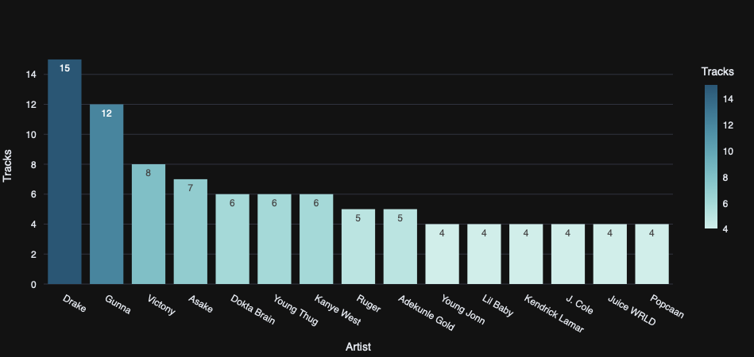
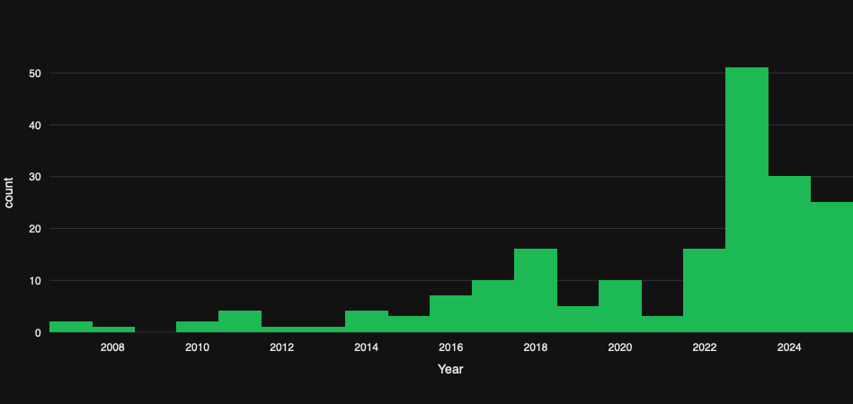

# 🎧 TrackPulse — Spotify ETL & Dashboard

{: style="width:100px;height:auto;"}

Analyze top tracks, artists, and albums in real-time!

---

## 🚀 Project Overview
TrackPulse is an end-to-end data engineering project that extracts, transforms, and loads Spotify playlist data into a PostgreSQL database, streams it via Kafka, and displays an interactive Streamlit dashboard for analysis.

**Key Features:**
- 🎵 Extract tracks from multiple Spotify playlists using the Spotify API  
- 🐍 Python ETL pipeline for data cleaning and transformation  
- 🐘 PostgreSQL for storing track, album, and playlist metadata  
- ☕ Kafka for streaming real-time track data  
- 🖥️ Streamlit dashboard for interactive visualizations  
- 📊 Metrics & charts: Top artists, tracks by popularity, release year trends  
- 🔗 Direct Spotify links to play tracks or preview audio  

---

## 🏗️ Project Architecture
Spotify API → ETL Pipeline (Python) → PostgreSQL → Kafka → Streamlit Dashboard

---

## ⚡ Features / Dashboard Highlights

**Filter tracks by artist or album**  
**View metrics:** Total tracks, unique artists, unique albums  

**Top Artists by Track Count**  
{: style="width:600px;height:auto;"}  

**Tracks by Release Year**  
{: style="width:600px;height:auto;"}  

**Dashboard Track Cards Preview**  
{: style="width:600px;height:auto;"}  

- Cards displaying album image, track info, and Spotify preview  
- Option to play preview directly or open full track on Spotify

---

## 💻 Setup & Usage

1️⃣ Clone the repository:

```bash
git clone https://github.com/Smartlyfe21/realtime-spotify-etl-trackpulse.git
cd realtime-spotify-etl-trackpulse


2️⃣ Create .env file
SPOTIFY_CLIENT_ID=your_spotify_client_id
SPOTIFY_CLIENT_SECRET=your_spotify_client_secret
SPOTIFY_REDIRECT_URI=http://127.0.0.1:8888/callback

KAFKA_BOOTSTRAP_SERVERS=localhost:9092
KAFKA_TOPIC=spotify_tracks

DB_HOST=localhost
DB_PORT=5432
DB_NAME=spotify_db
DB_USER=postgres
DB_PASSWORD=postgres

LOG_DIR=logs


3️⃣ Install dependencies
pip install -r requirements.txt

4️⃣ Start PostgreSQL & Kafka
docker-compose up -d

5️⃣ Create PostgreSQL table
CREATE TABLE IF NOT EXISTS spotify_tracks (
    track_id TEXT PRIMARY KEY,
    track_name TEXT,
    artist_name TEXT,
    album_name TEXT,
    popularity INT,
    release_date DATE,
    album_image_url TEXT,
    playlist_id TEXT,
    playlist_name TEXT,
    preview_url TEXT
);

6️⃣ Run ETL
python src/run_etl.py

7️⃣ Launch Dashboard
streamlit run src/spotify_dashboard.py


📂 File Structure
Spotify_Data_Engineering/
│
├── src/
│   ├── extract.py
│   ├── transform.py
│   ├── load.py
│   ├── run_etl.py
│   ├── spotify_dashboard.py
│   ├── test_spotify.py
│   ├── utils.py
│   └── config.py
│
├── images/
│   ├── artist_tracks.png
│   └── music_year_trend.png
│
├── logs/
├── docker-compose.yml
├── requirements.txt
└── .env


📈 Future Improvements
Include audio features & genre analysis
Embed preview for all tracks (currently limited to avoid Spotify rate limits)
Add real-time alerts for trending tracks
Deploy dashboard online (Streamlit Cloud / Render / Heroku)


